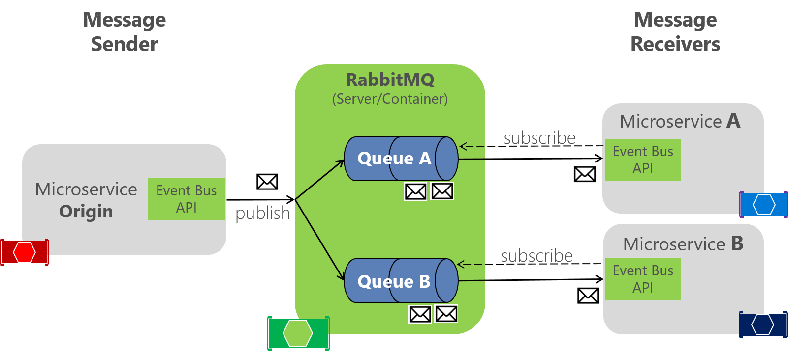

### Disclaimer

Si quieren ejecutar la aplicacion de ejemplo hay que modificar las rutas, ya que cada microservicio debe estar en su propio repositorio. Es solo un ejemplo.

# Docker

Herramienta que facilita el proceso de crear, administrar y ejecutar aplicaciones en entornos aislados llamados "contenedores". Estos contenedores son como paquetes que incluyen la aplicación y todas las cosas que necesita para funcionar, como bibliotecas y configuraciones. Docker hace que sea más fácil mover y ejecutar aplicaciones en diferentes computadoras sin preocuparse por diferencias en la configuración del sistema. Es como una caja virtual que contiene todo lo necesario para que una aplicación funcione, y se puede ejecutar en cualquier lugar donde Docker esté instalado.

Imagenes disponibles: [Docker Hub](https://hub.docker.com/search?q=)
Son plantillas ligeras y autónomas que encapsulan todo lo necesario para ejecutar una aplicación o servicio, lo que facilita la creación y el despliegue de contenedores consistentes y portátiles.

## Docker Desktop

[Instalacion](https://docs.docker.com/desktop/install/windows-install/) Windows


## Crear contenedor por consola

Crear un contenedor de RabbitMQ en docker por consola

**Estructura:**

```
docker run -d --name mi_rabbitmq -p 5672:5672 -p 15672:15672 -e RABBITMQ_DEFAULT_USER=usuario -e RABBITMQ_DEFAULT_PASS=contraseña rabbitmq:latest

```

**Ejemplo:**

```
docker run -d --hostname my-rabbit --name some-rabbit -p 15672:15672 -p 5672:5672 rabbitmq:3-management
```

### Crear contenedor con docker compose

**docker-compose.yml:**

```
version: '3'

services:
  rabbitmq:
    image: rabbitmq:latest
    ports:
      - "5672:5672"
      - "15672:15672"
    environment:
      RABBITMQ_DEFAULT_USER: usuario
      RABBITMQ_DEFAULT_PASS: contraseña

```

**Explicación simple:**

-   version: '3': Es la versión de Docker Compose que estamos utilizando.

-   services: Aquí definimos los servicios que queremos crear. En este caso, solo hay uno llamado "rabbitmq".

-   rabbitmq: Es el nombre del servicio.

-   image: rabbitmq:latest: Indicamos que queremos usar la última imagen oficial de RabbitMQ disponible en Docker Hub.

-   ports: Aquí especificamos qué puertos del contenedor queremos mapear al sistema host. RabbitMQ usa el puerto 5672 para la comunicación y el puerto 15672 para la interfaz de administración web.

-   environment: Establecemos variables de entorno para configurar RabbitMQ. En este ejemplo, creamos un usuario con nombre "usuario" y contraseña "contraseña" para acceder al servidor.

Para usar este archivo, simplemente guárdalo como docker-compose.yml y ejecuta el comando docker-compose up -d en el mismo directorio que contiene el archivo. Esto descargará la imagen de RabbitMQ (si no la tienes ya) y creará un contenedor de RabbitMQ con la configuración especificada.

# RabbitMQ

[_Explicacion larga [Ingles]_](https://www.cloudamqp.com/blog/part1-rabbitmq-for-beginners-what-is-rabbitmq.html)

RabbitMQ es un tipo de software que ayuda a diferentes partes de un programa a comunicarse entre sí. Imagina que tienes varias aplicaciones o partes de un programa que necesitan hablar entre sí, como un chat en línea donde los mensajes deben ser enviados y recibidos. RabbitMQ actúa como un mensajero que asegura que los mensajes lleguen al destinatario correcto. Ayuda a organizar y gestionar esta comunicación de manera eficiente, asegurando que los mensajes no se pierdan y que todo funcione sin problemas.


La arquitectura básica de una _cola de mensajes/message queue_ es simple: hay aplicaciones de clientes llamadas _producers_ que crean mensajes y los envían al intermediario (message queue). Otras aplicaciones, llamadas comsumers, se conectan a la cola y se suscriben para procesar los mensajes. Un programa puede actuar como un productor, o como un consumidor, o incluso como ambos, produciendo y consumiendo mensajes. Los mensajes colocados en la cola se guardan allí hasta que un consumidor los recupera.


**Flujo de mensajes en RabbitMQ:**

1. El producer publica un mensaje a un intercambio. Al crear un intercambio, se debe especificar el tipo.
2. El intercambio recibe el mensaje y ahora es responsable de dirigirlo. El intercambio tiene en cuenta diferentes atributos del mensaje, como la clave de enrutamiento, según el tipo de intercambio.
3. Se deben crear vinculaciones desde el intercambio a las colas. En este caso, hay dos vinculaciones a dos colas diferentes desde el intercambio. El intercambio dirige el mensaje a las colas según los atributos del mensaje.
4. Los mensajes permanecen en la cola hasta que son manejados por un consumidor.
5. El consumidor maneja el mensaje.

### RPC


(Remote Procedure Call) es una forma de hacer que dos programas se comuniquen entre sí de manera remota. Permite a un programa enviar una solicitud a otro programa y recibir una respuesta, todo a través de RabbitMQ como intermediario.

-   Imagina que tienes un programa A que necesita que un programa B realice una tarea específica. Con RPC, A puede enviar una solicitud a B a través de RabbitMQ. B ejecuta la tarea y devuelve el resultado a A. Esto permite una comunicación eficiente entre diferentes partes de una aplicación distribuida.

    **Ejemplo**
    
