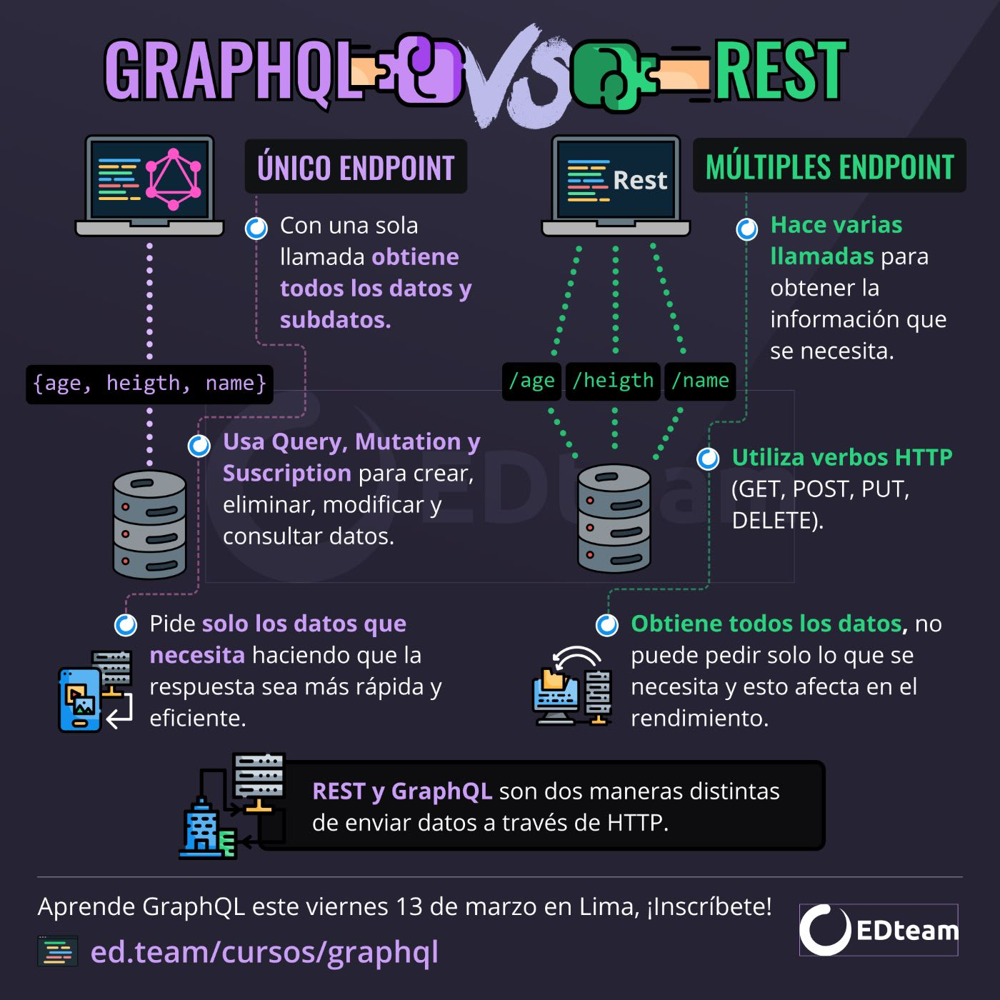
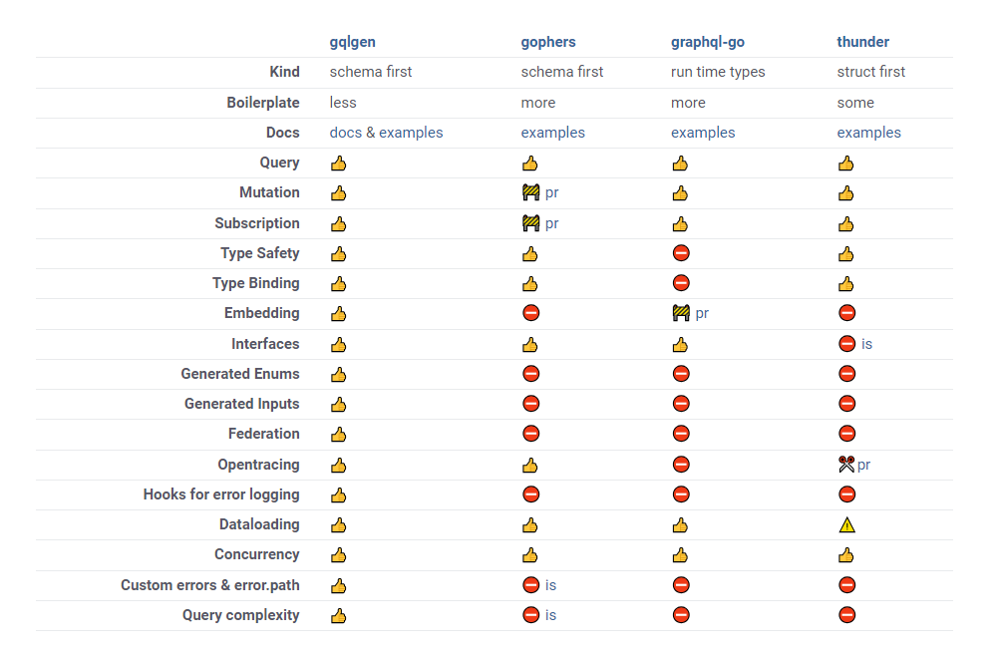
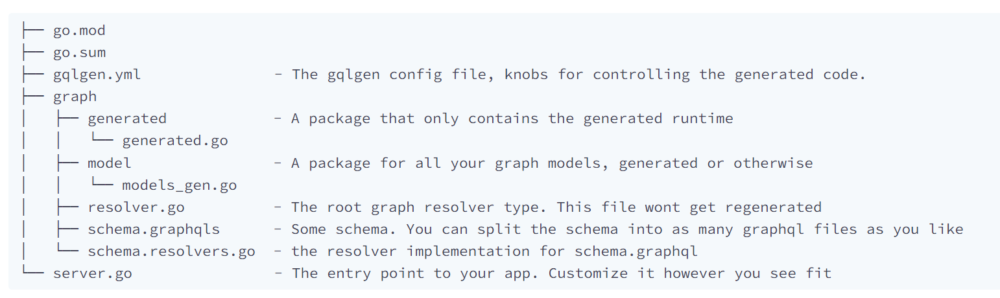

# GraphQL

[Docs](https://graphql.com)
GraphQL es un lenguaje de consulta para APIs, desarrollado por Facebook. Permite a los clientes solicitar solo los datos que necesitan, lo que hace que las respuestas sean más eficientes y personalizadas.

## GraphQL vs REST



### Schema, Querys y mutations

En GraphQL, se define un esquema que describe los tipos de datos y las relaciones entre ellos en el sistema. Este esquema sirve como contrato entre el cliente y el servidor.

Ejemplo de un esquema GraphQL simple para una aplicación de libros:

**Definicion del schema**

```graphql
type Libro {
	id: ID!
	titulo: String!
	autor: String!
	anioPublicacion: Int!
}

type Query {
	libro(id: ID!): Libro!
	libros: [Libro!]
}

type Mutation {
	crearLibro(titulo: String!, autor: String!, anioPublicacion: Int!): Libro!
}
```

###### Los signos de exclamación (!) al final de los tipos y campos en GraphQL indican que esos valores no pueden ser nulo

**Como hacer las querys y mutaciones**

```graphql
query getUser{
  libro(id: "1") {
    titulo
    autor
  }
}
mutation {
  crearLibro(titulo: "La Metamorfosis", autor: "Franz Kafka", añoPublicacion: 1915) {
    id
    titulo
    autor
    anioPublicacion
  }
}
```

# GraphQL en golang

[glgenlibrary](https://gqlgen.com/getting-started/)



```bash
go mod init github.com/[username]/graph-gateway-server

```

Crear archivo tools.go:

```go
//go:build tools
// +build tools

package tools

import (
	_ "github.com/99designs/gqlgen"
)
```

Crear directorios:

```go
go run github.com/99designs/gqlgen init
```



**Resolvers**

Los resolvers son funciones encargadas de obtener los datos solicitados en una consulta. Cada campo en un esquema de GraphQL tiene su propio resolver. Estos resolvers son responsables de obtener y retornar los datos correspondientes a partir de una fuente de datos, como una base de datos o un servicio externo.

**Configuracion extra:**

Agregar propios modelos:

crear archivos:

-   graph/models/task.go
-   graph/models/user.go

En el archivo gqlgen.yml:

descomentar

```yml
autobind:
    - "github.com/[username]/gqlgen-todos/graph/model"
```

```yml
models:
    ID:
        model:
            - github.com/99designs/gqlgen/graphql.ID
            - github.com/99designs/gqlgen/graphql.Int
            - github.com/99designs/gqlgen/graphql.Int64
            - github.com/99designs/gqlgen/graphql.Int32
    Int:
        model:
            - github.com/99designs/gqlgen/graphql.Int
            - github.com/99designs/gqlgen/graphql.Int64
            - github.com/99designs/gqlgen/graphql.Int32
    User:
        fields:
            task:
                resolver: true
    Task:
        fields:
            user:
                resolver: true
```
